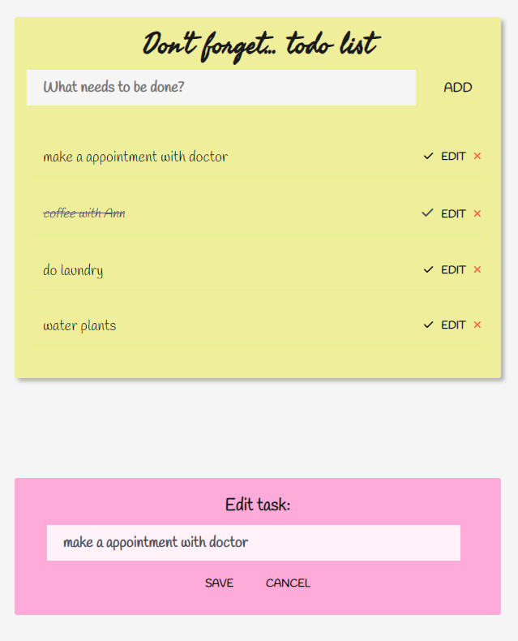

# 📝 DESCRIPTION
Don't forget is your handy 'yellow sticky note' application.
'Don't forget' helps you to stay organized and manage your day-to-day tasks.

You can add your tasks, highlight the most important tasks, uncheck tasks that are done.
You can clear a single task or all of them.

# 📓 TECHNOLOGIES
* JavaScript (Vanilla JS)
* GitFlow
* HTML5
* CSS3
* Fontawesome

# 👌 FEATURES
* You can add and manage tasks.
* You can edit your task, popup window will show up. 
* You can remove your task - it wil be shown as cross out

# ▶️ DEMO
https://kingakw.github.io/....

# 🆔 LICENSE
MIT License

